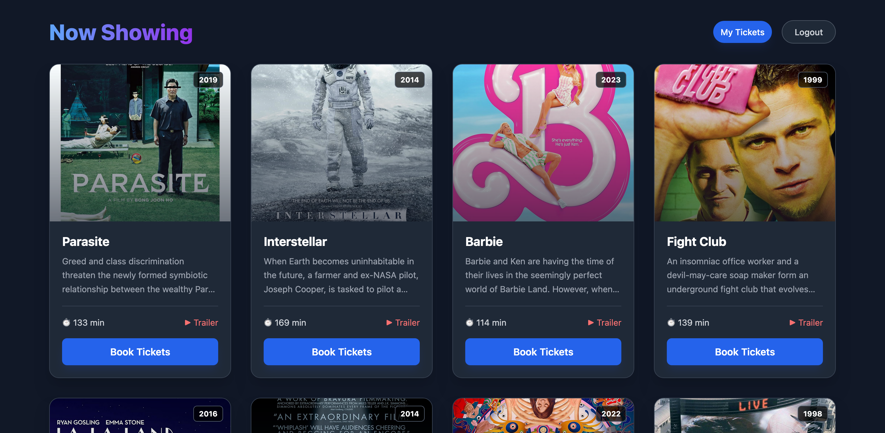
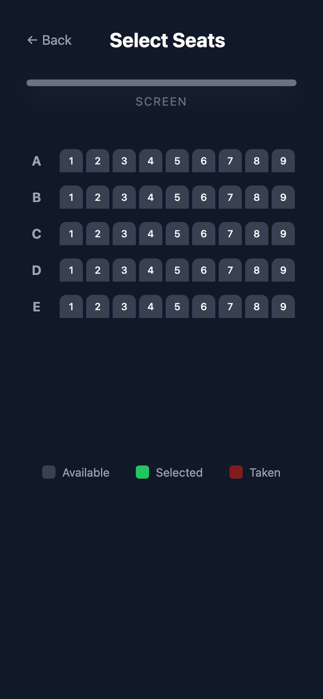

# 🎬 Cinema Booking System

**Languages:** [English](#english) | [日本語](#日本語)

## English

A cinema booking system that allows users to browse movies, view session availability, and reserve seats.
The system was built with **React** and **Node.js** and it uses a RESTful API and PostgreSQL to ensure data integrity under concurrent booking requests.

🔗 **Live Demo:** [Click Here](https://louridojoe-booking.vercel.app/)

🎥 **Video Demo:** Short booking flow walkthrough (WIP)

---

## 🛠 Tech Stack

**Frontend**
* **React (Vite):** Fast, component-based UI.
* **Tailwind CSS:** Fully responsive mobile-first design.
* **Axios:** Efficient API data fetching.

**Backend**
* **Node.js & Express:** RESTful API architecture.
* **PostgreSQL:** Relational database for structured data integrity.
* **JWT (JSON Web Tokens):** Secure stateless authentication.

**Deployment**
* **Frontend:** Vercel
* **Backend:** Render
* **Database:** Neon (Serverless Postgres)

---

## ✨ Key Features

### Real-Time Seat Selection
* **Interactive Seat Map:** Custom-built grid system that handles seat availability status (Available, Selected, Taken).
* **Mobile-Optimized:** The seat map features a "compact mode" and horizontal scrolling wrapper to ensure a smooth experience on small screens without breaking the page layout.

### Robust Booking Engine
* **Atomic Transactions:** Uses SQL transactions to ensure that once a seat is selected, it is temporarily locked for other users to prevent race conditions.
* **Smart Expiration System:** Bookings start as `PENDING`. If payment isn't confirmed within the time limit (e.g., 10 minutes), the server automatically expires the reservation and releases the seat back to the pool.
* **Concurrency Handling:** Database constraints prevent double-booking even under high load.

### Security and Reliability
* **Secure Auth:** Password hashing with **Bcrypt** and protected routes using JWT middleware.
<details>
  <summary><strong>View Database Schema (ER Diagram)</strong></summary>

  

</details>

#### _This project focuses on backend reliability and data consistency rather than payment processing or production-scale optimizations._
---

## 📸 Screenshots

| Dashboard (Desktop) | Seat Selection (Mobile) |
|:-------------------:|:-----------------------:|
|  |  |

---

## Architecture Overview
The frontend communicates with the backend via a RESTful API.
Business logic and authentication are handled in the API layer, while PostgreSQL enforces relational constraints and seat uniqueness at the database level.

## Getting Started Locally

Follow these steps to run the project on your machine.

### 1. Clone the Repository
```bash
git clone https://github.com/joelourido/booking-system-api.git
cd booking-system-api
```

### 2. Backend Setup
```bash
cd server
npm install

# Create a .env file in the /server directory
# Add the following variables:
DB_HOST=localhost
DB_PORT=5432
DB_USER=postgres
DB_PASSWORD=yourdbpass
DB_NAME=yourdbname
JWT_SECRET=yourjwtsecret

# Database Setup
npm run db:reset   # Creates tables
npm run db:seed    # Seeds movies and sessions
npm run dev        # Starts server on localhost:3000
```

### 3. Frontend Setup
```bash
cd ../client
npm install

# Create a .env file in the /client directory with:
VITE_API_URL=http://localhost:3000/api

npm run dev
# App will run at http://localhost:5173
```

## 日本語

### 概要
映画館のチケット予約・座席管理を行うフルスタックWebアプリケーションです。
実際の運用を想定し、**同時アクセス時のデータ整合性**と**排他制御**に重点を置いて設計しました。RESTful API と PostgreSQL のトランザクション処理を活用し、高負荷時でも座席の二重予約（ダブルブッキング）を確実に防ぎます。

### 主な機能
- **リアルタイム座席選択:**
  モバイル端末に最適化されたインタラクティブな座席マップ（React）を提供。
- **堅牢な予約システム:**
  PostgreSQLのトランザクションを用いたアトミックな処理により、競合状態（Race Condition）を防止。
- **予約ステータス管理:**
  「仮押さえ（Pending）」から「確定（Confirmed）」、または時間切れによる「自動開放（Expired）」まで、ステートマシンによる厳格な状態管理を実装。

### 技術スタック
- **フロントエンド:** React (Vite), Tailwind CSS
- **バックエンド:** Node.js, Express
- **データベース:** PostgreSQL (Neon Serverless)
- **認証:** JWT (JSON Web Tokens) + Bcrypt

---
※ セットアップ手順や詳細な仕様については、上部の [English Section](#english) をご参照ください。
